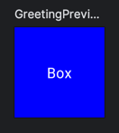

# **Box**
> - 여러 Composable 요소를 겹쳐서 놓거나 정렬하기 위해 사용하는 레이아웃이다.
> - Xml의 FrameLayout과 비슷하다.

<br>

## **Box 구조**
```kotlin
@Composable
inline fun Box(
    modifier: Modifier = Modifier,
    contentAlignment: Alignment = Alignment.TopStart,
    propagateMinConstraints: Boolean = false,
    content: @Composable BoxScope.() -> Unit
)
```

### modifier
- `Box` 에 대한 수정자(Modifier)이다.
- 이를 사용하여 `Box` 의 크기, 패딩, 색상, 클릭 처리 등을 조정할 수 있다.

### contentAlignment
- `Box` 내부의 자식 Composable 요소의 기본 정렬 방식을 지정한다.
- 기본값은 `Alignment.TopStart` 로, 자식 Composable 요소가 `Box` 의 시작점(왼쪽 상단)에 위치된다.

### propagateMinConstraints
- 최소 제약 조건을 자식 Composable 요소에 적용할지 여부를 나타낸다.
- 기본값은 `false` 로, 자식 Composable 요소에 최소 제약 조건이 적용되지 않는다.

### content
- `Box` 내부에 포함될 자식 Composable 요소를 정의하는 함수이다.
- 이 함수는 `BoxScope` 의 함수와 속성을 사용하여 `Box` 내부의 Composable 요소를 정의할 수 있다.

<br>

## **Box 사용**
```kotlin
Box(
    modifier = Modifier
        .size(100.dp)
        .background(Color.Blue),
    contentAlignment = Alignment.Center
) {
    Text("Box", color = Color.White)
}
```
- 크기가 100dp인 파란색 상자(Box)를 생성한다.
- 상자 내부에 텍스트(Text)를 중앙 정렬하여 배치한다.

### 실행화면



***