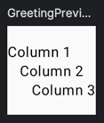

# **Column**
> - Composable 요소를 수직으로 배치하는 레이아웃이다.

<br>

## **Column 구조**
```kotlin
@Composable
inline fun Column(
modifier: Modifier = Modifier,
verticalArrangement: Arrangement.Vertical = Arrangement.Top,
horizontalAlignment: Alignment.Horizontal = Alignment.Start,
content: @Composable ColumnScope.() -> Unit
)
```

### modifier
- `Column` 에 대한 수정자(Modifier)이다.
- 이를 사용하여 `Column` 의 크기, 패딩, 색상 등을 조정할 수 있다.

### verticalArrangement
- 수직 방향으로 자식 Composable 요소를 배치하는 방식을 지정하는 속성이다.
- 기본값은 `Arrangement.Top` 로, 자식 Composable 요소가 `Column` 의 상단에 위치된다.

### horizontalAlignment
- 수평 방향에서 자식 Composable 요소의 정렬 방식을 지정하는 속성이다. 
- 기본값은 `Alignment.Start` 로 자식 Composable 요소를 `Column` 시작점(왼쪽)에 정렬된다.

### content
- `Column` 내부에 포함될 자식 Composable 요소를 정의하는 함수이다.
- 이 함수는 `ColumnScope` 의 함수와 속성을 사용하여 `Column` 내부의 Composable 요소를 정의할 수 있다.

<br>

## **Column 사용**
```kotlin
Column(
    verticalArrangement = Arrangement.Center,
    horizontalAlignment = Alignment.CenterHorizontally,
    modifier = Modifier.size(100.dp)
) {
    Text(
        text = "Column 1",
        modifier = Modifier.align(Alignment.Start)
    )
    Text(text = "Column 2")
    Text(
        text = "Column 3",
        modifier = Modifier.align(Alignment.End)
    )
}
```
- 크기가 100dp인 컬럼(Column)을 생성한다.
- 컬럼 내부에 텍스트(Text) 3개를 수직으로 배치한다.
- 모든 요소를 수직 중앙에 배치한다.
- 각 요소의 수평 정렬을 시작점, 중앙, 끝점으로 조절한다.

### 실행화면



***