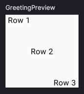

# **Row**
> - Composable 요소를 수평으로 배치하는 레이아웃이다.
 
<br>

## **Row 구조**
```kotlin
@Composable
inline fun Row(
    modifier: Modifier = Modifier,
    horizontalArrangement: Arrangement.Horizontal = Arrangement.Start,
    verticalAlignment: Alignment.Vertical = Alignment.Top,
    content: @Composable RowScope.() -> Unit
)
```

### modifier
- `Row` 에 대한 수정자(Modifier)이다.
- 이를 사용하여 `Row` 의 크기, 패딩, 색상 등을 조정할 수 있다.

### horizontalArrangement
- 수평 방향으로 자식 Composable 요소를 배치하는 방식을 지정하는 속성이다.
- 기본값은 `Arrangement.Start` 로, 자식 Composable 요소가 `Row` 시작점(왼쪽)에 정렬된다.

### verticalAlignment
- 수직 방향에서 자식 Composable 요소의 정렬 방식을 지정하는 속성이다.
- 기본값은 `Alignment.Top` 로 자식 Composable 요소를 `Row` 상단에 위치된다.

### content
- `Row` 내부에 포함될 자식 Composable 요소를 정의하는 함수이다.
- 이 함수는 `RowScope` 의 함수와 속성을 사용하여 `Row` 내부의 Composable 요소를 정의할 수 있다.

<br>

## **Row 사용**
```kotlin
Row(
    verticalAlignment = Alignment.CenterVertically,
    horizontalArrangement = Arrangement.Center,
    modifier = Modifier.size(100.dp)
) {
    Text(
        text = "Row 1",
        modifier = Modifier.align(Alignment.Top)
    )
    Text(text = "Row 2")
    Text(
        text = "Row 3",
        modifier = Modifier.align(Alignment.Bottom)
    )
}
```
- 크기가 100dp인 로우(Row)을 생성한다.
- 로우 내부에 텍스트(Text) 3개를 수평으로 배치한다.
- 모든 요소를 수평 중앙에 배치한다.
- 각 요소의 수직 정렬을 상단, 중앙, 하단으로 조절한다.

### 실행화면



***