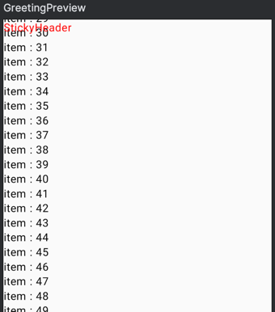

# **LazyColumn**
> - 리스트나 그리드와 같은 수직으로 스크롤 가능한 요소를 생성하기 위해 사용하는 레이아웃이다.
> - 대량의 데이터를 효율적으로 표시할 수 있으며, 사용자가 스크롤할 때 데이터를 필요한 시점에 렌더링한다.

<br>

## **LazyColumn 구조**
```kotlin
@Composable
fun LazyColumn(
    modifier: Modifier = Modifier,
    state: LazyListState = rememberLazyListState(),
    contentPadding: PaddingValues = PaddingValues(0.dp),
    reverseLayout: Boolean = false,
    verticalArrangement: Arrangement.Vertical =
        if (!reverseLayout) Arrangement.Top else Arrangement.Bottom,
    horizontalAlignment: Alignment.Horizontal = Alignment.Start,
    flingBehavior: FlingBehavior = ScrollableDefaults.flingBehavior(),
    userScrollEnabled: Boolean = true,
    content: LazyListScope.() -> Unit
)
```

### modifier
- `LazyColumn` 에 대한 수정자(Modifier)이다.
- 이를 사용하여 `LazyColumn` 의 레이아웃 및 스타일 수정을 할 수 있다.

### state
- `LazyColumn` 의 스크롤 상태를 제어하는 데 사용된다.
- 기본값은 `rememberLazyListState()` 로, 처음 렌더링될 때 스크롤 상태를 초기화하고 관리하기 위해 사용된다.

### contentPadding
- `LazyColumn` 내부의 내용에 대한 패딩을 지정한다.
- 기본값은 `PaddingValues(0.dp)` 로, 기본적으로 어떤 패딩도 적용되지 않는다.

### reverseLayout
- `true` 로 설정하면 `LazyColumn` 의 항목이 역순으로 배치된다. 즉, 아래쪽에서 위쪽으로 스크롤하게 된다.
- 기본값은 `false` 로, `LazyColumn` 의 항목이 위쪽에서 아래쪽으로 배치된다.

### verticalArrangement
- 수직 방향으로 `LazyColumn` 내부 항목의 배치 방식을 지정하는 속성이다.
- 기본값은 `Arrangement.Top 또는 Arrangement.Bottom` 로, `LazyColumn` 의 항목이 상단이나 하단에 위치된다.

### horizontalAlignment
- 수평 방향에서 `LazyRow` 내부 항목의 정렬 방식을 지정하는 속성이다.
- 기본값은 `Alignment.Start` 로, `LazyColumn` 의 항목이 `LazyColumn` 시작점(왼쪽)에 정렬된다.

### flingBehavior
- 스크롤 플링 동작을 제어하는 데 사용된다.
- 기본값은 `ScrollableDefaults.flingBehavior()` 로, Compose의 스크롤 동작을 따른다.

### userScrollEnabled
- 사용자가 스크롤 동작을 수행할 수 있는지 여부를 나타낸다.
- 기본값은 `true` 로, 사용자가 스크롤을 할 수 있다.

### content
- `LazyColumn` 내부의 UI 요소를 정의하는 함수이다.
- 이 함수는 `LazyListScope` 의 함수와 속성을 사용하여 `LazyColumn` 내부의 UI 요소를 정의할 수 있다.

<br>

### **LazyColumn 사용**
```kotlin
LazyColumn(
    modifier = Modifier.fillMaxWidth(),
    content = {
        items(100) { index ->
            Text(text = "item : $index")
        }
    }
)
```
- 화면의 전체 크기를 차지하는 `LazyColumn` 를 생성한다.
- items 함수를 사용하여 100개의 항목을 동적으로 생성한다.

### 실행화면



***