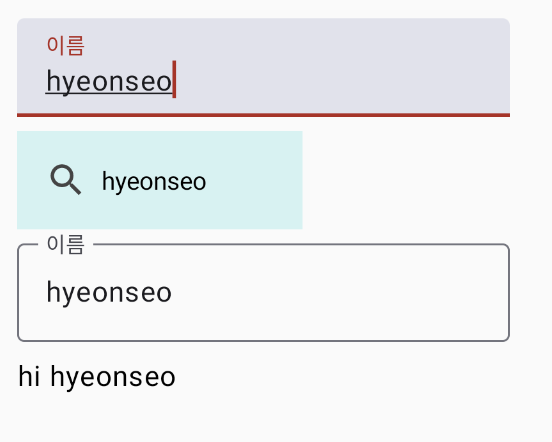

# **TextField**
> - 사용자로부터 텍스트 입력을 받을 수 있게 하는 Composable이다.
> - 텍스트를 입력할 수 있는 상자와 선택적으로 레이블과 에러 메시지를 포함할 수 있다.

<br>

## **TextField**
```kotlin
@ExperimentalMaterial3Api
@Composable
fun TextField(
    value: String,
    onValueChange: (String) -> Unit,
    modifier: Modifier = Modifier,
    enabled: Boolean = true,
    readOnly: Boolean = false,
    textStyle: TextStyle = LocalTextStyle.current,
    label: @Composable (() -> Unit)? = null,
    placeholder: @Composable (() -> Unit)? = null,
    leadingIcon: @Composable (() -> Unit)? = null,
    trailingIcon: @Composable (() -> Unit)? = null,
    supportingText: @Composable (() -> Unit)? = null,
    isError: Boolean = false,
    visualTransformation: VisualTransformation = VisualTransformation.None,
    keyboardOptions: KeyboardOptions = KeyboardOptions.Default,
    keyboardActions: KeyboardActions = KeyboardActions.Default,
    singleLine: Boolean = false,
    maxLines: Int = Int.MAX_VALUE,
    interactionSource: MutableInteractionSource = remember { MutableInteractionSource() },
    shape: Shape = TextFieldDefaults.filledShape,
    colors: TextFieldColors = TextFieldDefaults.textFieldColors()
)
```

### value
- `TextField` 에 표시되는 텍스트 내용 및 업데이트할 텍스트 값을 나타내는 문자열이다.

### onValueChange
- `TextField` 의 텍스트가 변경될 때 호출되는 콜백 함수로, 새로운 값을 전달받는다.

### modifier
- `TextField` 에 대한 수정자(Modifier)이다.
- 이를 사용하여 `TextField` 의 레이아웃 및 스타일 수정을 할 수 있다.

### enabled
- `TextField` 의 활성화 상태를 나타낸다.
- `true` 로 설정하면 `TextField` 가 활성화되며 클릭 가능하다. 반대로 `false` 로 설정하면 `TextField` 가 비활성화되어 클릭이 불가능하다.

### readOnly
- `true` 로 설정하면 `TextField` 는 읽기 전용 모드가 되며 사용자 입력을 허용하지 않는다.

### textStyle
- `TextField` 내부 텍스트의 스타일을 정의하는 `TextStyle` 이다.

### label
- `TextField` 에 대한 레이블을 정의하는 Composable이다. 
- 레이블은 `TextField` 위에 나타난다.

### placeholder
- `TextField` 에 값이 없을 때 나타나는 `placeholder` 를 정의하는 Composable이다.

### leadingIcon, trailingIcon
- `TextField` 의 시작, 끝 부분에 표시할 아이콘을 정의하는 Composable이다.

### supportingText
- `TextField` 아래에 추가 정보 또는 안내를 표시할 수 있는 Composable이다.

### isError
- `TextField` 의 내용이 잘못된 경우 `true` 로 설정하여 에러 상태를 나타낸다. 
- 이 경우, 에러 메시지가 나타날 수 있다.

### visualTransformation
- 입력한 텍스트를 숨기거나 변형하는 데 사용되는 `VisualTransformation` 이다.

### keyboardOptions
- `TextField` 와 상호 작용할 키보드 동작을 정의한다.

### keyboardActions
- 사용자가 키보드에서 엔터 키를 눌렀을 때 수행할 동작을 정의한다.

### singleLine
- `true` 로 설정하면 `TextField` 는 한 줄로 표시된다.

### maxLines
- `TextField` 에서 입력 가능한 최대 줄 수를 제한한다.

### interactionSource
- `TextField` 의 상호 작용 소스를 정의한다.

### shape
- `TextField` 의 모양을 정의한다.

### colors
- `TextField` 의 색상을 정의한다.

<br>

## **TextField 사용**
```kotlin
var name by remember { mutableStateOf("") }

Column(modifier = Modifier.padding(16.dp)) {
    TextField(
        value = name,
        label = {
            Text(text = "이름")
        },
        onValueChange = { name = it },
        isError = true
    )
    Spacer(modifier = Modifier.size(8.dp))
    BasicTextField(
        value = name,
        onValueChange = { name = it },
        decorationBox = { innerTextField ->
            Row(
                modifier = Modifier
                    .background(color = Color(0xFFD2F3F2))
                    .padding(16.dp),
                verticalAlignment = Alignment.CenterVertically,
            ) {
                Icon(
                    imageVector = Icons.Default.Search,
                    contentDescription = "",
                    tint = Color.DarkGray,
                )
                Spacer(modifier = Modifier.width(width = 8.dp))
                innerTextField()
            }
        },
    )
    OutlinedTextField(
        value = name,
        label = {
            Text(text = "이름")
        },
        onValueChange = { name = it }
    )
    Spacer(modifier = Modifier.size(8.dp))
    Text(text = "hi $name")
}
```
- 사용자의 이름을 저장할 변수를 생성한다.
- TextField, BasicTextField, OutlinedTextField를 수직으로 배치한다.
- 사용자가 입력한 이름을 Text에 보여준다.

### 실행화면



***