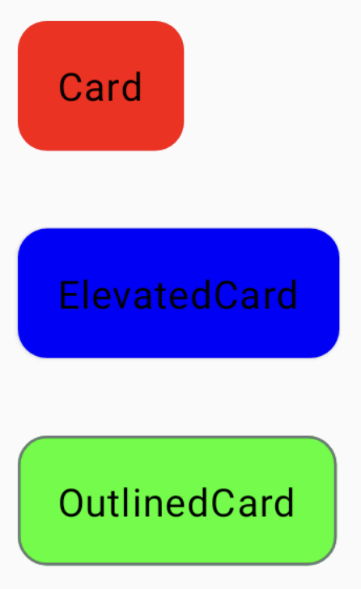

# **Card**
> - UI 요소를 감싸고 나타내는 데 사용되는 Material Design 구성 요소 중 하나이다.
> - 그림자 효과와 테두리를 가진 컴포넌트를 만들 수 있으며, 주로 정보를 그룹화하거나 특정 UI 요소를 더 두드러지게 표시할 때 사용한다.

<br>

## **Card 구조**
```kotlin
@Composable
fun Card(
    onClick: () -> Unit,
    modifier: Modifier = Modifier,
    enabled: Boolean = true,
    shape: Shape = CardDefaults.shape,
    colors: CardColors = CardDefaults.cardColors(),
    elevation: CardElevation = CardDefaults.cardElevation(),
    border: BorderStroke? = null,
    interactionSource: MutableInteractionSource = remember { MutableInteractionSource() },
    content: @Composable ColumnScope.() -> Unit
)
```

### onClick
- `Card` 를 클릭했을 때 발생할 액션을 정의하는 함수이다.
- 사용자가 Card를 클릭하면 이 함수가 호출된다.

### modifier
- `Card` 에 대한 수정자(Modifier)이다.
- 이를 사용하여 `Card` 의 레이아웃 및 스타일 수정을 할 수 있다.

### enabled
- `Card` 의 활성화 상태를 나타냅니다.
- `true` 로 설정하면 `Card` 가 활성화되며 클릭 가능하다. 반대로 `false` 로 설정하면 `Card` 가 비활성화되어 클릭이 불가능하다.

### shape
- `Card` 의 모양을 정의한다. 일반적으로 `RoundedCornerShape` 또는 `CutCornerShape` 와 같은 Shape를 사용하여 `Card` 의 모서리를 라운드하거나 잘라낼 수 있다.
- 기본값은 `CardDefaults.shape` 로, 일반적으로 사용되는 기본 `Card` 모양을 나타내며 모서리가 약간 둥글게 처리된다.

### colors
- `Card` 의 색상을 정의한다. 이를 통해 배경 색상, 그림자 색상 및 테두리 색상을 사용자 지정할 수 있다.
- 기본값은 `CardDefaults.cardColors())` 로, 기본적으로 `Card` 의 배경 색상은 흰색이며, 그림자 색상은 회색으로 설정된다.

### elevation
- `Card` 의 그림자를 정의한다. 그림자는 `Card` 를 시각적으로 부각시키며, elevation을 조절하여 그림자의 깊이를 변경할 수 있다.
- 기본값은 `CardDefaults.cardElevation()` 로, 기본적으로 Card는 상당한 그림자를 가지며, 사용자 지정할 수 있다.

### border
- `Card` 주위에 테두리를 정의한다. `BorderStroke` 를 사용하여 `Card` 주위에 선을 그릴 수 있다. `null` 로 설정하면 테두리가 없다.
- 기본값은 `null` 로, `Card` 에 테두리가 없다.

### interactionSource
- `Card` 의 상호 작용 소스를 정의한다. 이를 통해 Card가 터치, 클릭 및 다른 상호 작용 이벤트를 감지하고 대응할 수 있다.
- 기본값은 `remember { MutableInteractionSource() }` 로, 상호 작용 이벤트를 추적하고 처리하기 위한 가변 상호 작용 소스를 생성한다.

### content
- `Card` 내부의 UI 요소를 정의하는 함수이다.
- 이 함수는 `ColumnScope` 의 함수와 속성을 사용하여 `Card` 내부의 UI 요소를 정의할 수 있다.

<br>

## **Card 사용**
```kotlin
Column(modifier = Modifier.fillMaxSize()) {
    Card(
        modifier = Modifier.padding(16.dp),
        colors = CardDefaults.cardColors(Color.Red)
    ) {
        Box(modifier = Modifier.padding(16.dp)) {
            Text(text = "Card")
        }
    }
    ElevatedCard(
        modifier = Modifier.padding(16.dp),
        colors = CardDefaults.cardColors(Color.Blue)
    ) {
        Box(modifier = Modifier.padding(16.dp)) {
            Text(text = "ElevatedCard")
        }
    }
    OutlinedCard(
        modifier = Modifier.padding(16.dp),
        colors = CardDefaults.cardColors(Color.Green)
    ) {
        Box(modifier = Modifier.padding(16.dp)) {
            Text(text = "OutlinedCard")
        }
    }
}
```
- 화면전체를 차지하는 Column을 생성한다.
- Card, ElevatedCard, OutlinedCard를 수직으로 배치한다.
- 각 Card 내부에 Text가 포함된 Box가 있고, 각 Card에 내용을 나타낸다.

### 실행화면



***