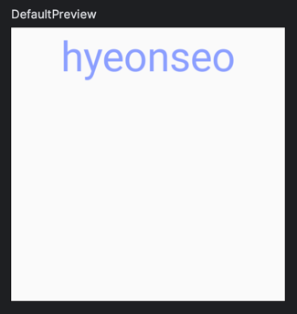

# **Custom Theme**
> - 앱의 디자인을 사용자 정의하고 일관성 있게 유지하며 디자인 변경을 관리하기 위해 사용한다.
 
<br>

## **Custom Theme 사용**
```kotlin
@Composable
fun CustomText() {
    CustomTheme { colors, typography ->
        Text(
            text = "hyeonseo",
            color = colors.color1,
            style = typography.content1,
            textAlign = TextAlign.Center,
            modifier = Modifier.size(200.dp),
        )
    }
}

@Composable
fun CustomTheme(
    colors: CustomColors = CustomColors,
    typography: CustomTypography = CustomTypography,
    content: @Composable (colors: CustomColors, typography: CustomTypography) -> Unit
) {
    content(colors, typography)
}

object CustomColors {
    val color1 = Color(0xFF8C9EFF)
}

object CustomTypography {
    val content1 = TextStyle(
        fontSize = 30.sp,
        lineHeight = 16.sp
    )
}
```
- `CustomColors` 는 사용자 정의 색상을 정의하는 객체이다.
- `CustomTypography`는 사용자 정의 텍스트 스타일을 정의하는 객체이다.
- `CustomTheme` 는 사용자 정의 색상 및 텍스트 스타일을 정의하기 위한 함수로, colors 및 typography 매개변수로 사용자 정의 테마에 대한 정보를 받고, 그런 다음 content라는 람다를 호출하고 이 람다는 주어진 colors 및 typography를 사용하여 Composable을 그린다.
- `CustomText` 는 `CustomTheme` 함수를 사용하여 사용자 지정 테마를 적용한 후 Text를 그린다.

### 실행화면



***