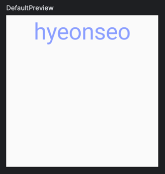
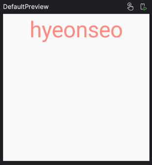

# **Custom Theme**
> - 앱의 디자인을 사용자 정의하고 일관성 있게 유지하며 디자인 변경을 관리하기 위해 사용한다.
 
<br>

## **Custom Theme 사용**
```kotlin
@Composable
fun CustomText() {
    CustomTheme { colors, typography ->
        Text(
            text = "hyeonseo",
            color = colors.color1,
            style = typography.content1,
            textAlign = TextAlign.Center,
            modifier = Modifier.size(200.dp),
        )
    }
}

@Composable
fun CustomTheme(
    content: @Composable (colors: ColorTheme, typography: CustomTypography) -> Unit
) {
    val isDarkTheme = isSystemInDarkTheme()

    val themeColors = if (isDarkTheme) {
        DarkModeColors // 다크 모드 색상
    } else {
        LightModeColors // 화이트 모드 색상
    }

    val themeTypography = CustomTypography

    content(themeColors, themeTypography)
}

abstract class ColorTheme {
    abstract val color1: Color
}

object DarkModeColors: ColorTheme() {
    override val color1 = Color(0xFF82B1FF)
}

object LightModeColors: ColorTheme() {
    override val color1 = Color(0xFFFF8A80)
}

object CustomTypography {
    val content1 = TextStyle(
        fontSize = 30.sp,
        lineHeight = 16.sp
    )
}
```
- `ColorTheme` 는 `CustomTheme` 에서 사용하는 추상 클래스이다.
- `ColorTheme을` 확장하는 두 개의 객체 `DarkModeColors` 와 `LightModeColors` 를 정의한다. 
- `CustomTypography`는 사용자 정의 텍스트 스타일을 정의하는 객체이다.
- `CustomTheme` 는 사용자 정의 색상 및 텍스트 스타일을 정의하기 위한 함수로 현재 시스템의 다크 모드 여부를 확인하고 해당 모드에 따라서 ColorTheme 및 CustomTypography를 선택한다.
- `CustomText` 는 `CustomTheme` 함수를 사용하여 사용자 지정 테마를 적용한 후 Text를 그린다.

### 실행화면




***